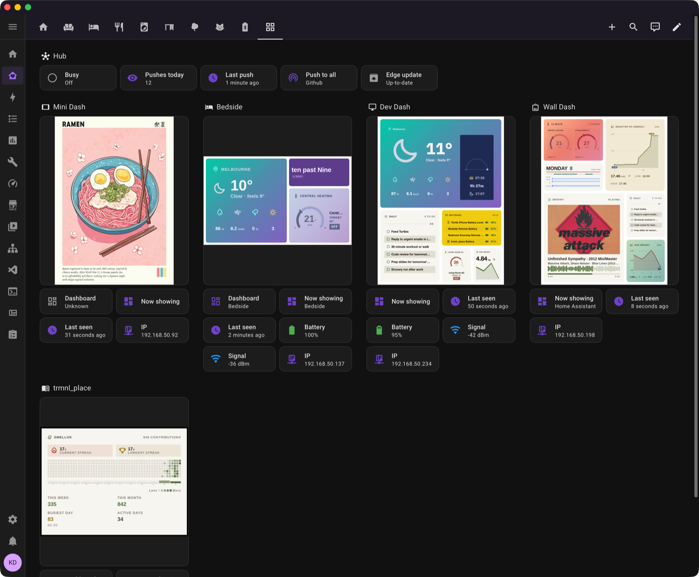
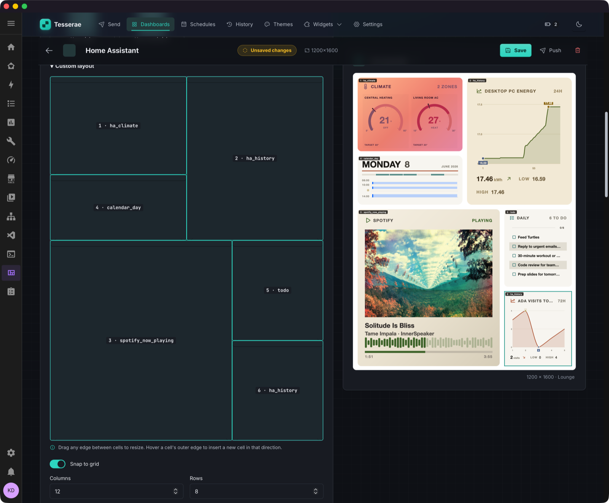
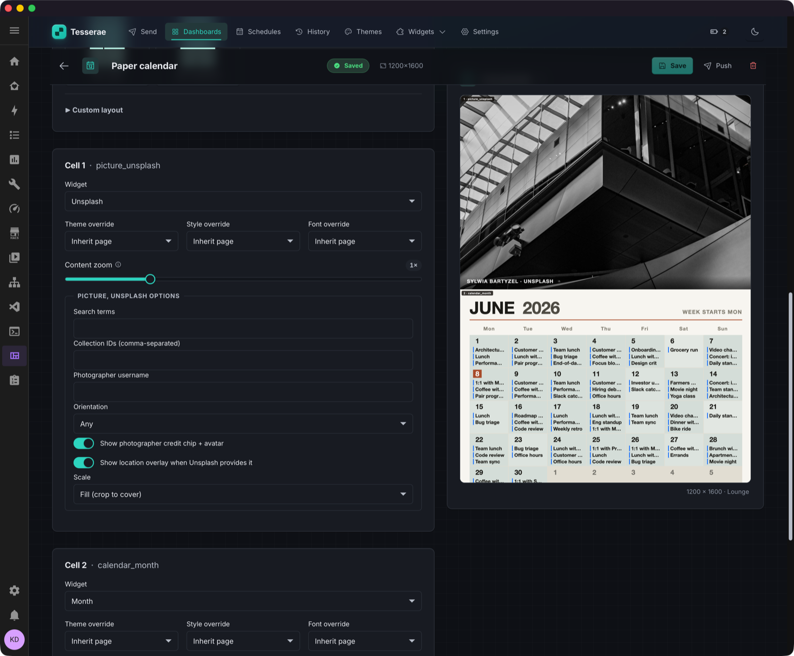
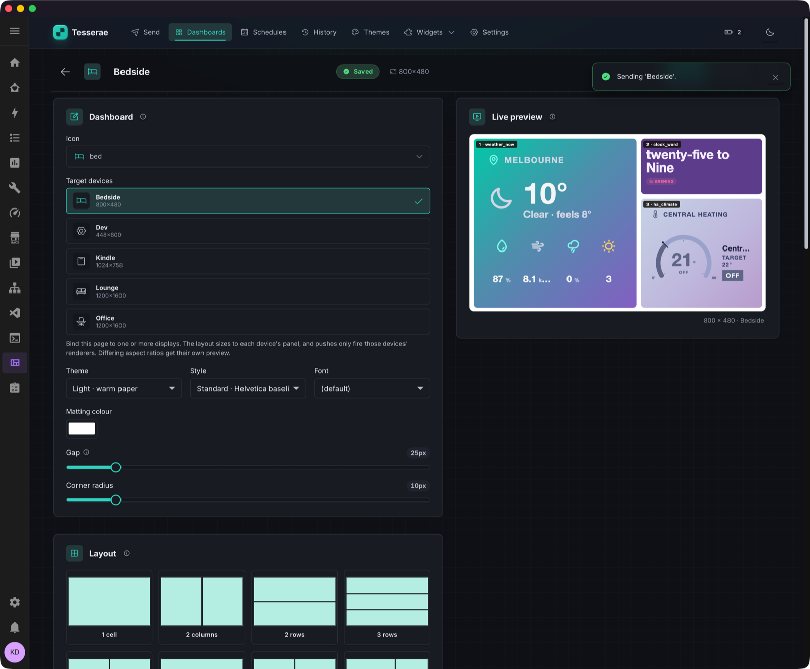
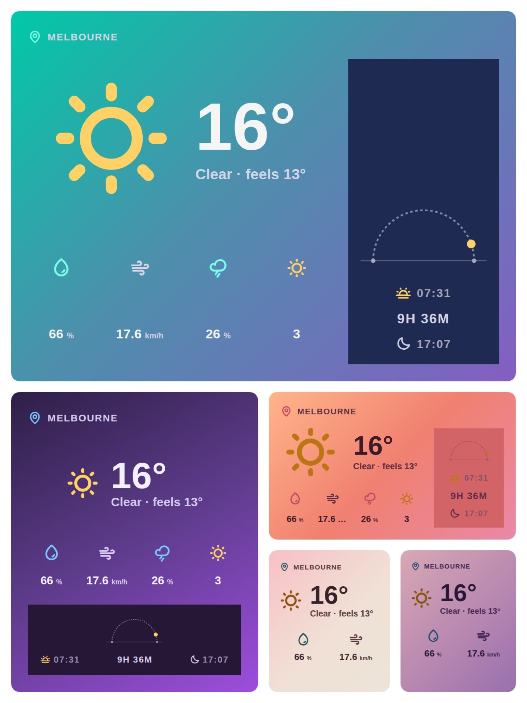

# Gallery

Screenshots of the Tesserae admin UI in action: composing dashboards, integrating with Home Assistant, and how a single widget handles being dropped into different cell sizes.

For panels in domestic context, see the [README](https://github.com/dmellok/tesserae/blob/main/README.md#tesserae) hero image. For the per-widget grid, see the [bundled widget gallery](widgets/gallery.md) or the [community catalog](https://tesserae.ink/catalog/).

## Inside Home Assistant

Tesserae lives inside HA. The Hub tile plus one device card per panel, each pulling its live image entity, battery, signal, and IP.

## Composing a dashboard

Composing a dashboard. Cell grid on the left, live preview on the right with HA widgets (climate gauges, history, calendar, Spotify, todo).

"Paper Calendar" dashboard, full-bleed Unsplash photo + month grid, rendered at 1200×1600 for an Inky 13.3".

Bedside dashboard with two of the gradient themes, mid-send.

## One widget, every cell size

{ width="600" }

The same `weather_now_scenic` widget at four cell sizes. Widgets use CSS container queries to redistribute content as the cell shrinks, so one widget composes across every layout instead of shipping size-specific variants.
