<!-- AUTO-GENERATED by scripts/gen_widget_gallery.py, do not edit by hand. -->

# Widget gallery

The **36 widgets** that ship with Tesserae. Each is a drop-a-folder widget under `plugins/<id>/`; drop your own in and it shows up in the editor's picker. Want to build one? See [Build a widget with AI](../dev/writing-a-widget.md).

!!! tip "Looking for more widgets?"
    Browse the full community catalog at [tesserae.ink/catalog](https://tesserae.ink/catalog/): widgets, themes, and dashboard templates, all installable from **Settings → Widgets → Browse catalog** inside the app.

!!! note "Stability tiers"
    **Stable** = backed by an official, documented API. **Best-effort** = undocumented but long-lived endpoint. **Fragile** = scraping or a soft policy, convenience only. **Local** = computed on the host, no upstream to break. See [Screens & compatibility](../compatibility.md) for the hardware side.

## Weather

-   **Weather, Forecast** &middot; `weather_forecast`

    ---

    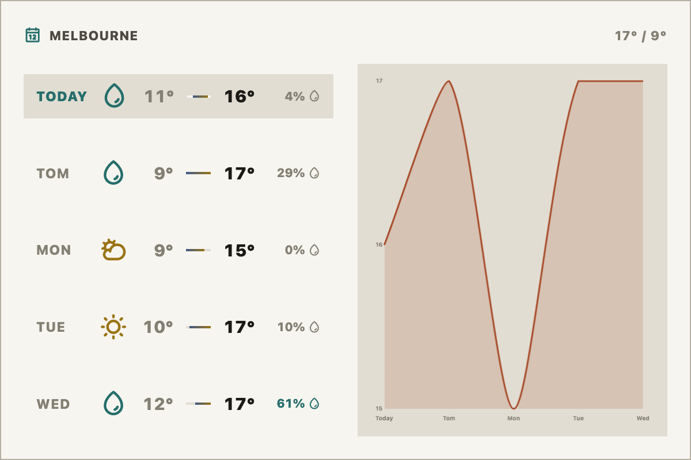

    5-day forecast as a row of theme-aware cards: day name, condition icon, high / low temps, and rain probability. Data from Open-Meteo (no API key).

    **Sizes:** `sm` `md` `lg` &middot; **Tier:** Stable

-   **Weather, Hourly** &middot; `weather_hourly`

    ---

    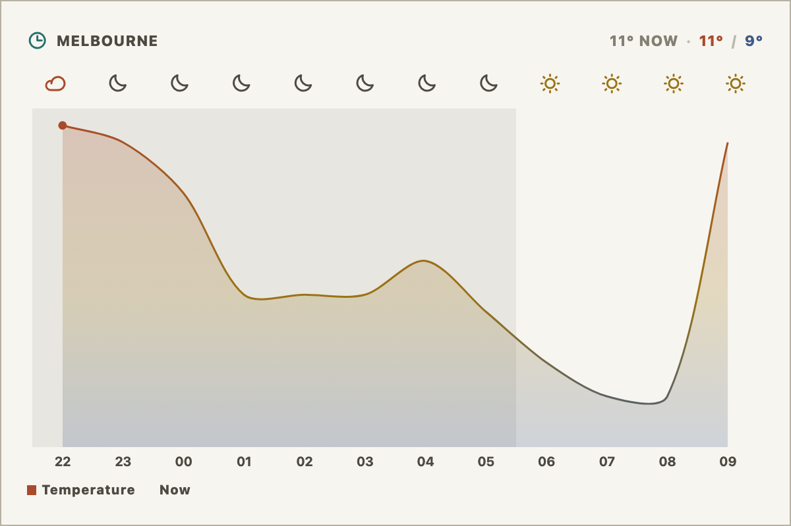

    Hourly temperature line with a shaded area + condition-icon strip across the top. Defaults to the next 12 hours; configurable to 24 or 48. Data from Open-Meteo (no API key).

    **Sizes:** `xs` `sm` `md` `lg` &middot; **Tier:** Stable

-   **Weather, Now** &middot; `weather_now`

    ---

    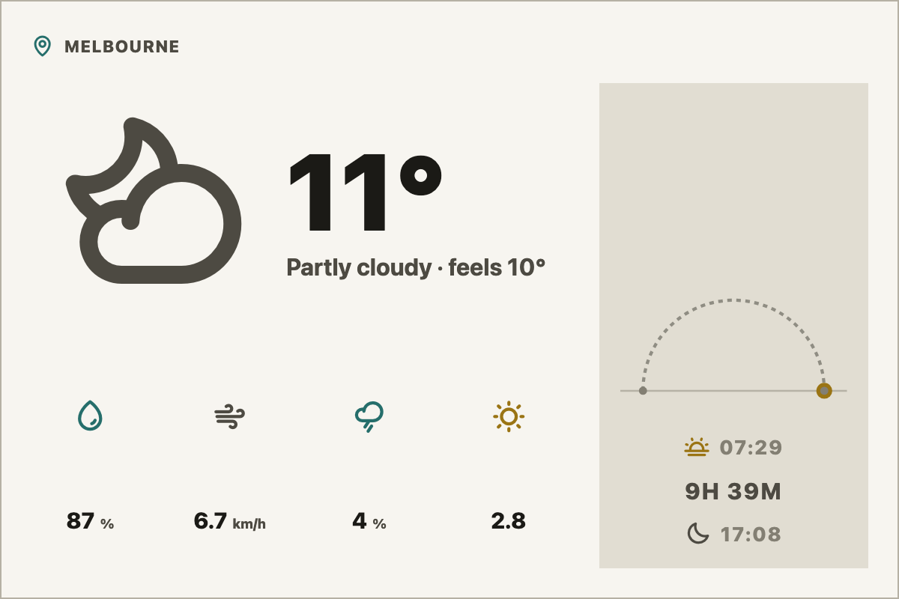

    Current conditions plus feels-like, humidity, wind, UV and sun times. Data from Open-Meteo (no API key required).

    **Sizes:** `xs` `sm` `md` `lg` &middot; **Tier:** Stable

-   **Weather, Scenic** &middot; `weather_now_scenic`

    ---

    _Screenshot pending, run `python scripts/capture_widget_shots.py`._

    Current weather as a pill card with weather-and-time-of-day theming. Uses the extended palette opt-in so soft gradients (sunset, night sky) render on 7-colour e-ink panels via the renderer's dither pass. Data from Open-Meteo (no API key).

    **Sizes:** `sm` `md` `lg` &middot; **Tier:** -

## Clocks & time

-   **Clock, Analog** &middot; `clock_analog`

    ---

    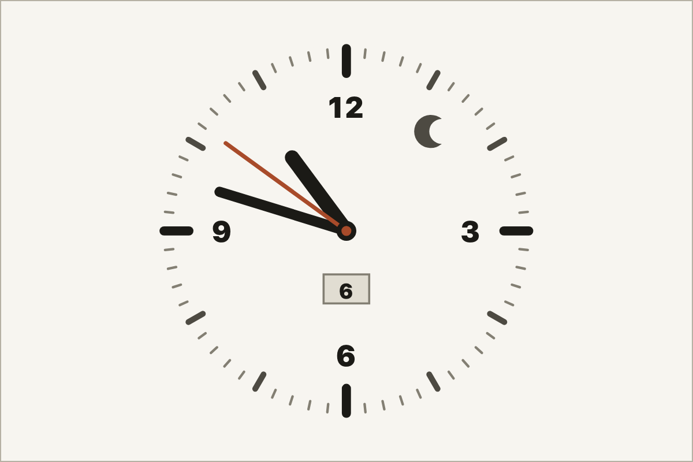

    Analog clock face. Pure SVG, no network. Five face styles, pick the one that suits the rest of your dashboard.

    **Sizes:** `xs` `sm` `md` `lg` &middot; **Tier:** Local

-   **Clock, Sunrise / Sunset** &middot; `clock_sunrise_sunset`

    ---

    

    Today's sunrise, sunset, golden hour, and day length for a chosen lat/lon. The hero shows a sun-arc visualisation with the current position marked. Data from Open-Meteo (no key).

    **Sizes:** `sm` `md` `lg` &middot; **Tier:** Stable

-   **Clock, Word** &middot; `clock_word`

    ---

    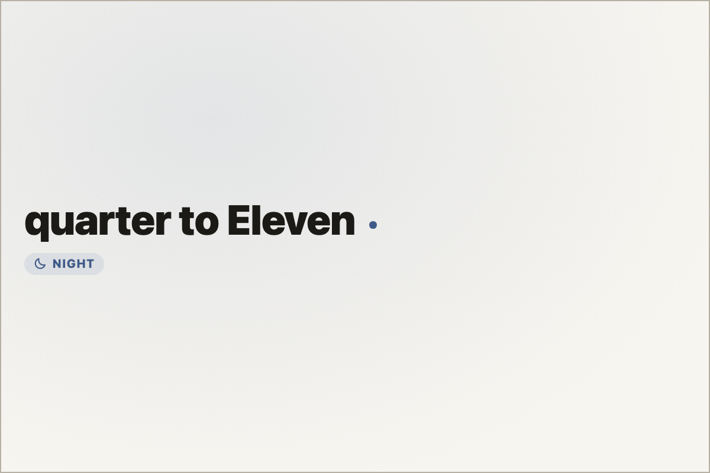

    Word clock, reads the time as English text, rounded to the nearest five minutes ('Twenty past three'). Pure client-side, ticks every 30 seconds.

    **Sizes:** `xs` `sm` `md` `lg` &middot; **Tier:** Local

## Calendar

-   **Calendar, Day** &middot; `calendar_day`

    ---

    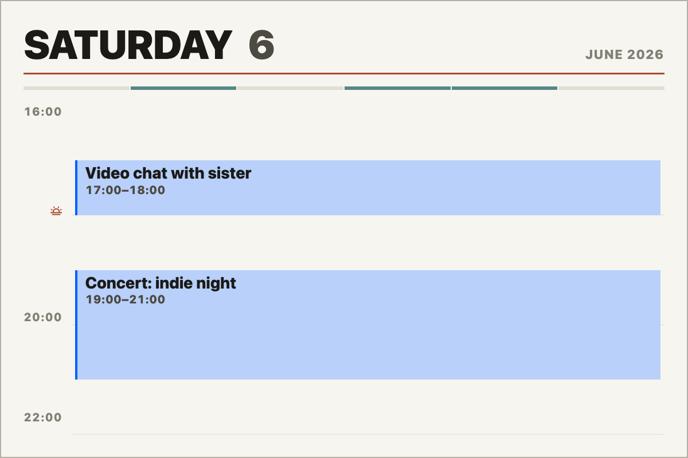

    Today's agenda with tunable event text sizing, a configurable visible-hour range, and a location toggle. Reads from feeds configured in Widgets → Calendar Feeds; each feed's colour drives the stripe / marker / fill colour.

    **Sizes:** `xs` `sm` `md` `lg` &middot; **Tier:** Stable

-   **Calendar, Month** &middot; `calendar_month`

    ---

    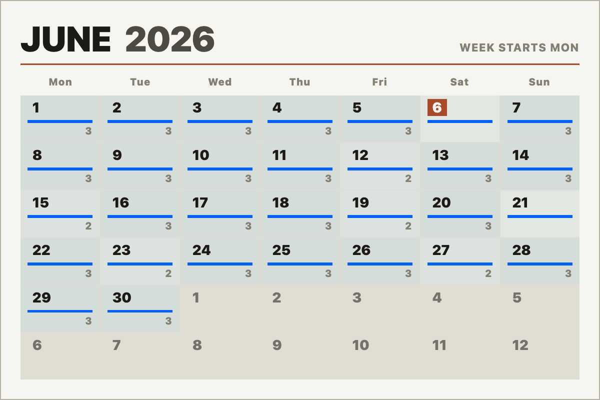

    Month-grid view with tunable dashboard title/day-number/event text sizing, cell spacing, and a location toggle for text-display mode. Each feed's colour drives the bar / dot / stripe colour.

    **Sizes:** `md` `lg` &middot; **Tier:** Stable

-   **Calendar, Week** &middot; `calendar_week`

    ---

    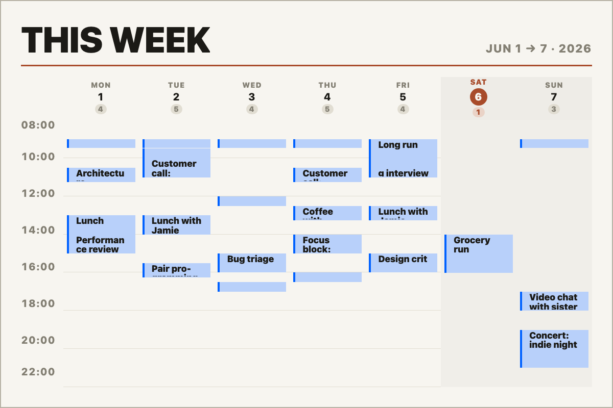

    Seven-day strip timetable with tunable event text sizing/spacing, configurable visible hour range, and a location toggle. Each event's colour comes from its feed (Widgets → Calendar Feeds).

    **Sizes:** `sm` `md` `lg` &middot; **Tier:** Stable

## News & feeds

-   **News, Hacker News** &middot; `news_hacker_news`

    ---

    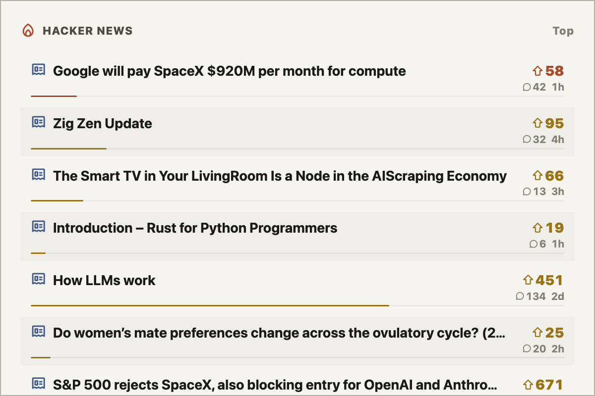

    Top / new / best / show / ask stories from Hacker News. Uses the free Firebase API (no auth, no key). Click-through opens the story; the lightbox doesn't apply.

    **Sizes:** `sm` `md` `lg` &middot; **Tier:** Stable

-   **News, Reddit** &middot; `news_reddit`

    ---

    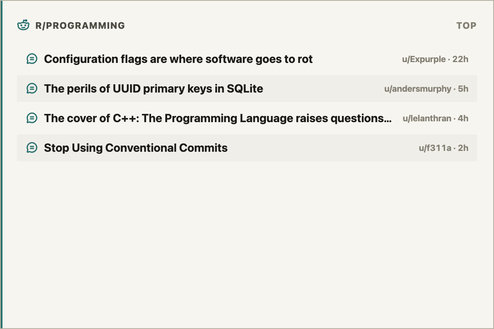

    Top posts from a subreddit using the free .json endpoint (no API key, no OAuth). Pick the subreddit and time window per cell.

    **Sizes:** `sm` `md` `lg` &middot; **Tier:** Fragile

-   **News, RSS / Atom** &middot; `news_rss`

    ---

    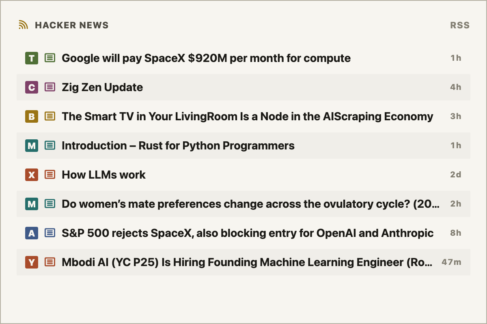

    Latest N headlines from any RSS 2.0 or Atom 1.0 feed. Paste a feed URL; the widget parses both formats with the stdlib XML parser (no extra deps).

    **Sizes:** `sm` `md` `lg` &middot; **Tier:** Stable

-   **News, Wikipedia On This Day** &middot; `news_wikipedia_otd`

    ---

    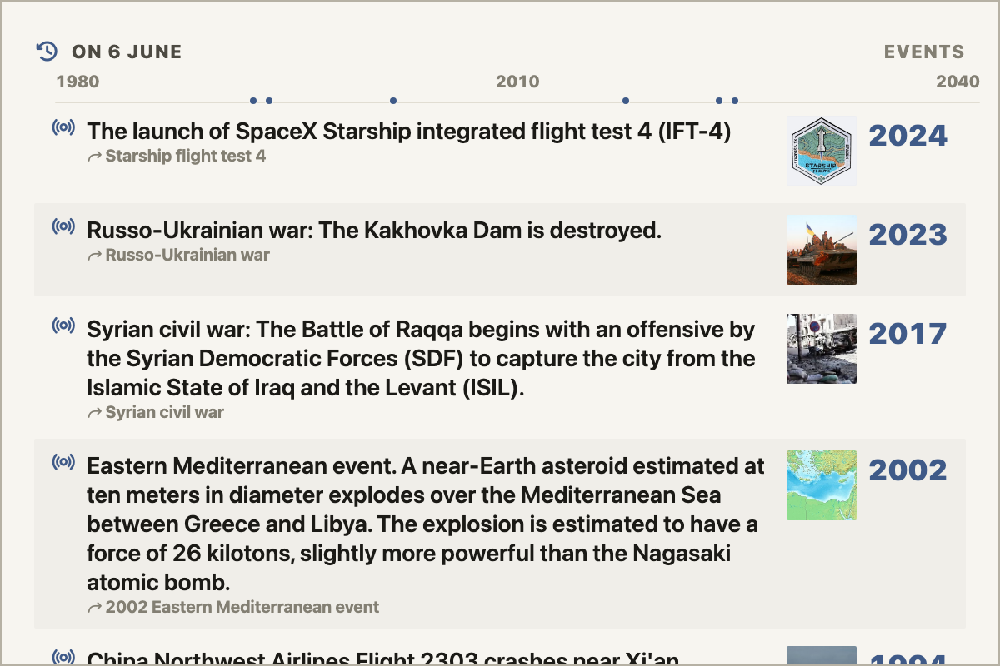

    Wikipedia 'On this day', featured historical events for today's date. Uses the free Wikimedia REST API (no key).

    **Sizes:** `sm` `md` `lg` &middot; **Tier:** Stable

## Home Assistant

-   **Home Assistant, Automation History** &middot; `ha_automation_history`

    ---

    _Screenshot pending, run `python scripts/capture_widget_shots.py`._

    Which Home Assistant automations fired, when, and how often. Ranks the most- vs least-fired automation this week, streams a most-recent-first trigger feed, tallies 1h / 24h / 7d trigger counts, and flags any tracked automation that hasn't fired within an expected cadence. Reads automation.* logbook history via the Home Assistant Core plugin.

    **Sizes:** `xs` `sm` `md` `lg` &middot; **Tier:** -

-   **Home Assistant, Batteries** &middot; `ha_battery`

    ---

    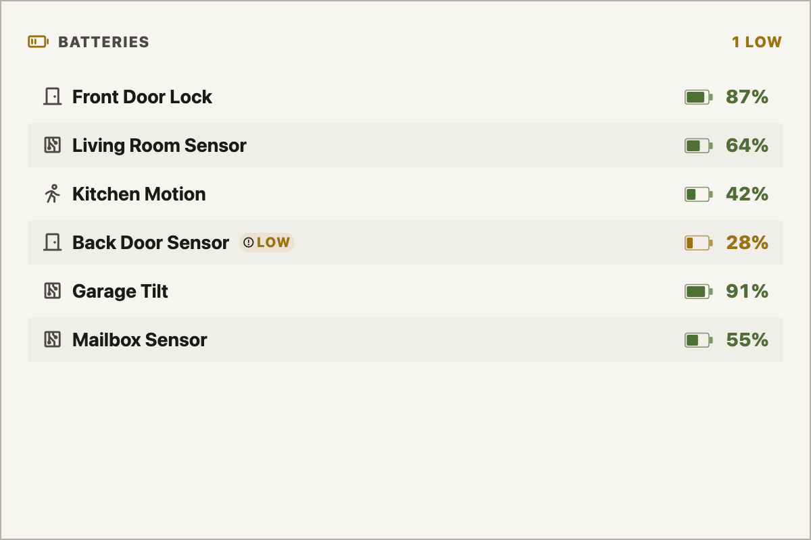

    Auto-discovered battery levels across every Home Assistant entity with device_class=battery, sorted lowest-first. Picks up phones, sensors, vacuums, remotes, anything HA already exposes as a battery, and flags low/critical against per-cell thresholds.

    **Sizes:** `sm` `md` `lg` &middot; **Tier:** Local

-   **Home Assistant, Camera** &middot; `ha_camera`

    ---

    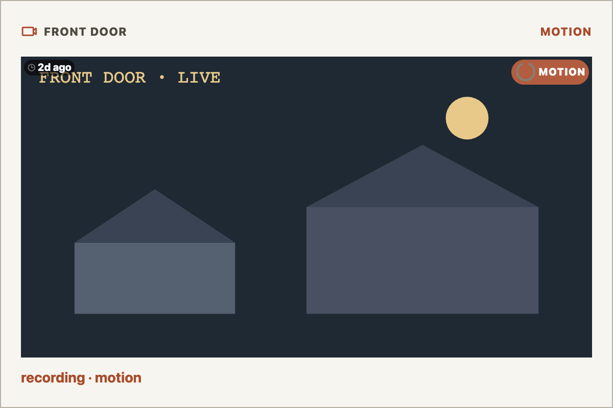

    Snapshot from one or more Home Assistant camera.* entities. Pulls each entity's entity_picture via HA's REST API and renders it as a still frame, perfect for a door cam, garden cam, or 2×2 grid of indoor cameras on an e-ink display. Multi-camera grids auto-fit; every tile carries a corner timestamp chip and a motion pip when relevant.

    **Sizes:** `sm` `md` `lg` &middot; **Tier:** -

-   **Home Assistant, Climate** &middot; `ha_climate`

    ---

    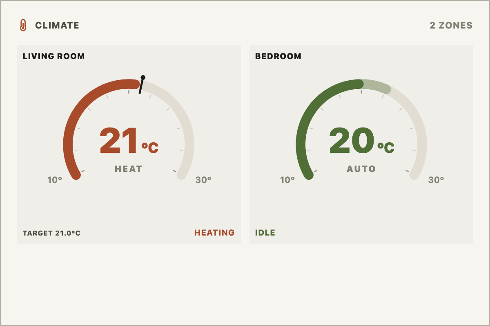

    One or more Home Assistant climate / thermostat entities Each entity tints by what the thermostat is doing right now (heating / cooling / idle). Requires the Home Assistant Core plugin.

    **Sizes:** `sm` `md` `lg` &middot; **Tier:** -

-   **Home Assistant, Energy** &middot; `ha_energy`

    ---

    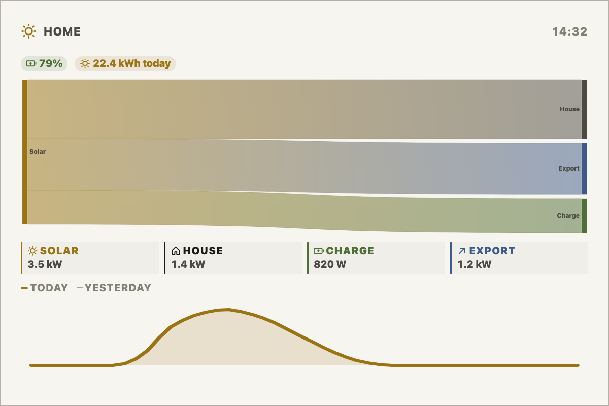

    Live solar / grid / battery / house-consumption snapshot from your HA energy dashboard, with today's totals and a 24-hour sparkline. Wires to the same sensor.* entities you've already configured under HA's Energy panel.

    **Sizes:** `sm` `md` `lg` &middot; **Tier:** Local

-   **Home Assistant, Entities** &middot; `ha_entities`

    ---

    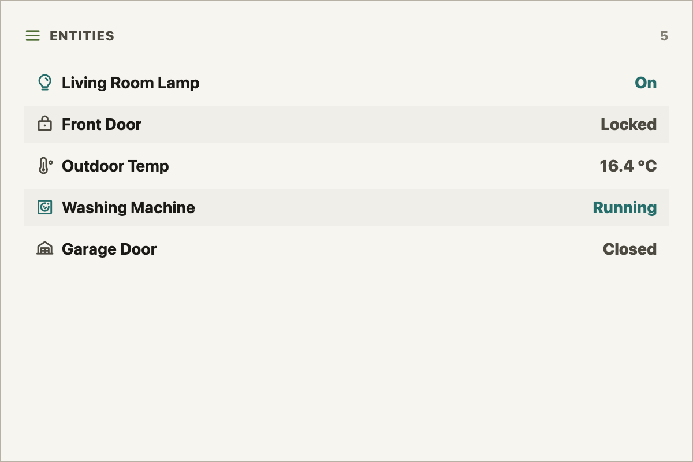

    A status grid of several Home Assistant entities. Each row tints by its state (on / off / other), leads with a device-class-aware Phosphor glyph (temperature → thermometer, CO₂ → wind, motion → person walking, …), and shows its current value. Rows that changed within the last 10 minutes pick up an accent-4 wash + a 'just now' / 'Nm ago' badge.

    **Sizes:** `sm` `md` `lg` &middot; **Tier:** -

-   **Home Assistant, History** &middot; `ha_history`

    ---

    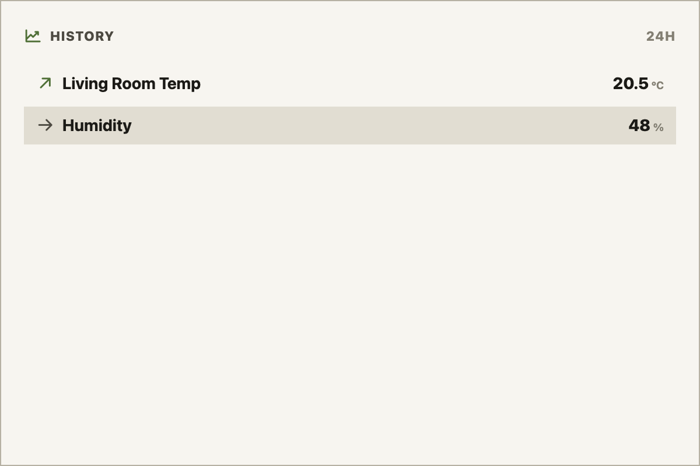

    A numeric Home Assistant sensor over time. Pairs the current value + trend arrow + min/max with a Chart.js line chart, optional threshold horizontal line, min/max marker dots + labels on the curve, and an averaged hourly-profile ghost overlay for long windows. Requires the Home Assistant Core plugin.

    **Sizes:** `sm` `md` `lg` &middot; **Tier:** -

-   **Home Assistant, Lights** &middot; `ha_lights`

    ---

    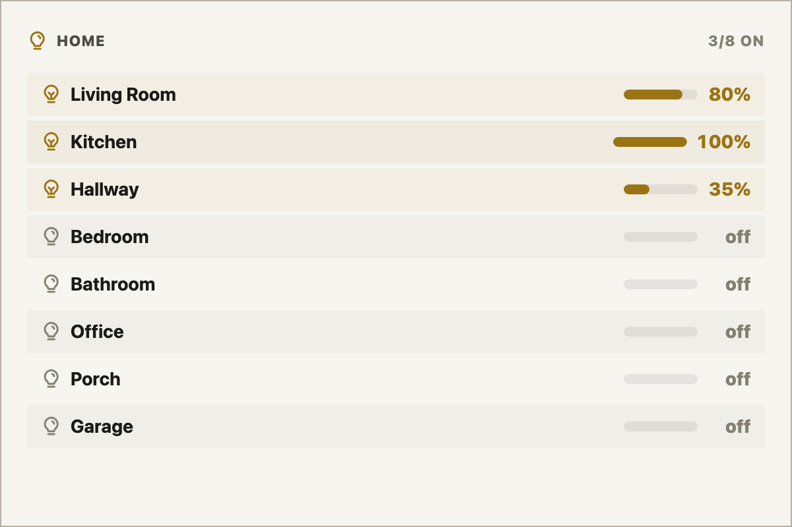

    An at-a-glance overview of a room (or whole-house) set of light.* entities: which are on, how bright, what colour, and what share of the house is currently lit. Each row carries a brightness mini-bar tinted by the light's actual colour-temperature (warm-white to cool-white) or RGB hue, plus a swatch dot for the colour itself. Reads from your existing Home Assistant install via the Core plugin.

    **Sizes:** `sm` `md` `lg` &middot; **Tier:** Local

-   **Home Assistant, Locks & Doors** &middot; `ha_locks`

    ---

    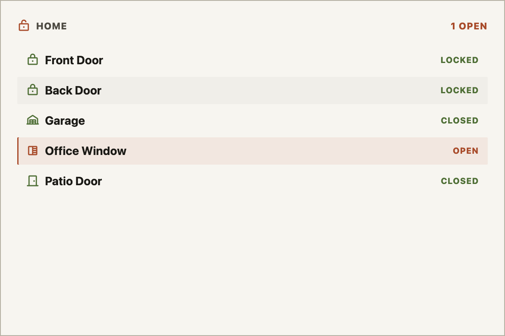

    A security-focused overview of every lock.* entity plus door / window / garage / opening binary_sensors. Stateful kind glyphs (ph-lock ↔ ph-lock-open, ph-door ↔ ph-door-open, etc.) communicate state via icon rather than text colour alone; unsecured rows wear a terracotta wash + an 'unsecured for Xm' timer chip. Auto-discovers entities, nothing to configure beyond the label and which kinds of openings to include.

    **Sizes:** `sm` `md` `lg` &middot; **Tier:** Local

-   **Home Assistant, Media** &middot; `ha_media`

    ---

    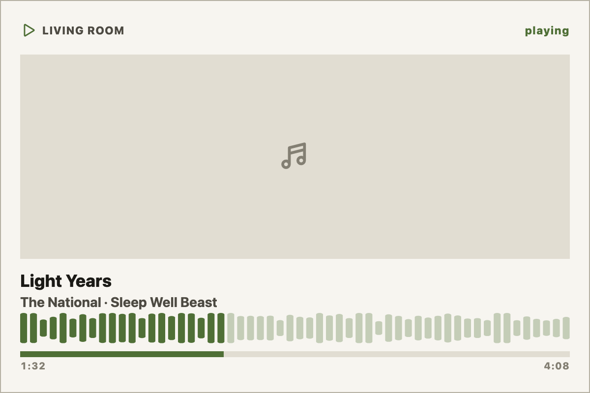

    Now-playing tile for a Home Assistant media_player entity, title, artist, album, album art, progress bar with elapsed / remaining stamps, and a track-deterministic SVG waveform glyph. A blurred copy of the album art bleeds behind the body so the cell picks up the album's palette. Requires the Home Assistant Core plugin.

    **Sizes:** `sm` `md` `lg` &middot; **Tier:** -

-   **Home Assistant, Sensor** &middot; `ha_sensor`

    ---

    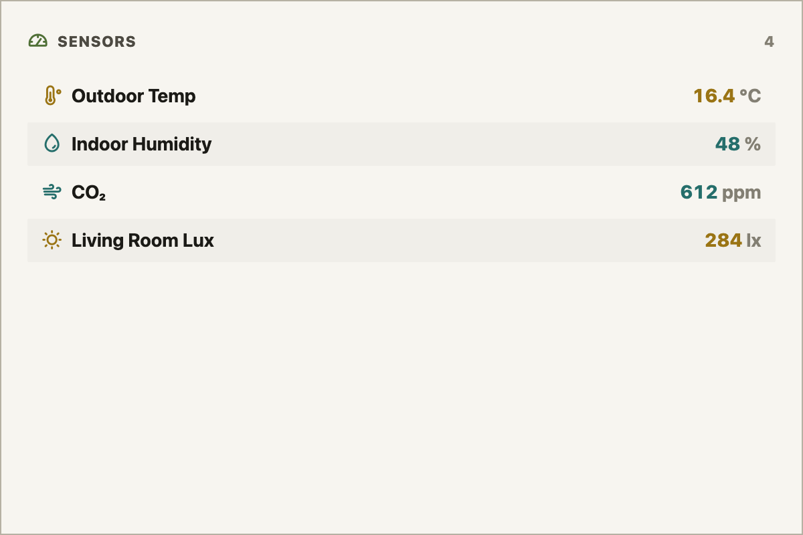

    One or more Home Assistant entities as bold value blocks. A single entity fills the cell as a hero number with a trend arrow + 24h sparkline beneath; several lay out as a list with per-row trend + hairline sparkline. Lead glyph picks up the device-class (temperature → thermometer, CO₂ → wind, current → wave-sine, money → coin, etc.). Requires the Home Assistant Core plugin.

    **Sizes:** `xs` `sm` `md` `lg` &middot; **Tier:** -

-   **Home Assistant, Todo** &middot; `ha_todo`

    ---

    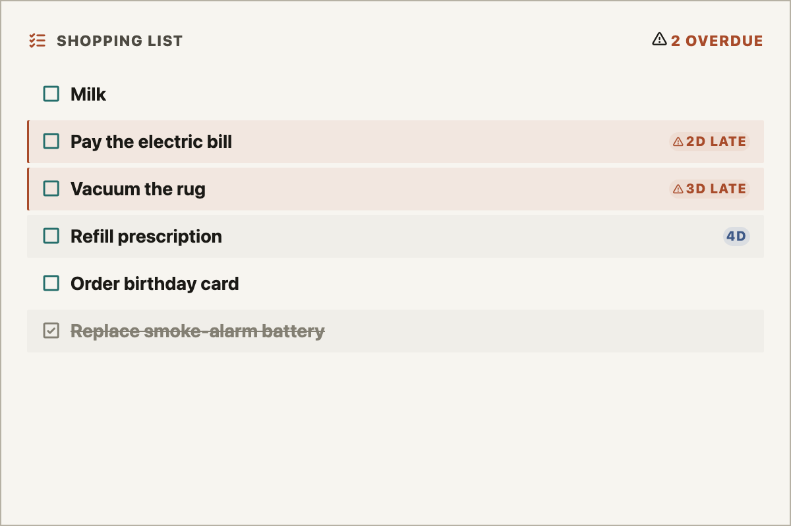

    Items from a Home Assistant todo list, built-in shopping list, Google Tasks, Microsoft To-Do, CalDAV, anything exposed as a todo.* entity. Lead with the items needing action; show due dates when the integration sets them. Requires HA 2024.5+ (the todo.get_items service with return_response). Requires the Home Assistant Core plugin.

    **Sizes:** `sm` `md` `lg` &middot; **Tier:** -

-   **Home Assistant, Zones** &middot; `ha_zones`

    ---

    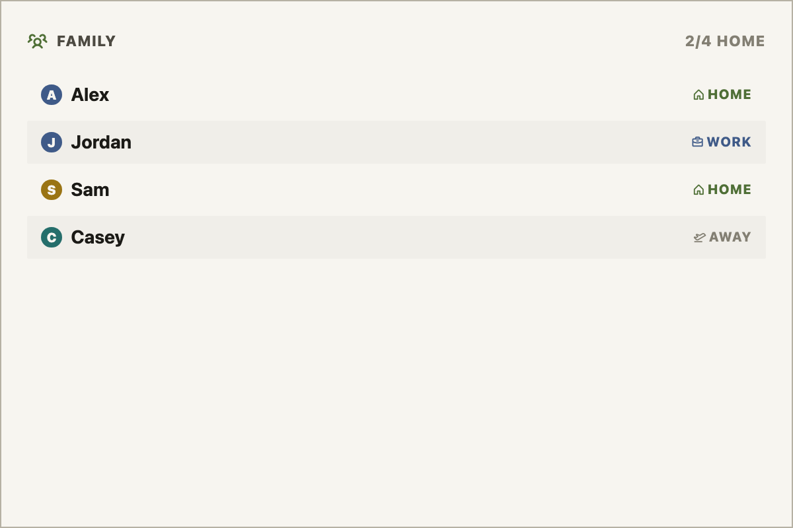

    Who's home, who's away, auto-discovers every person.* entity in Home Assistant. Each row leads with the person's avatar (HA profile picture, or a coloured-initials circle keyed to their name when there's no picture) and right-aligns a zone-glyph (briefcase for work, graduation-cap for school, barbell for gym, etc.) + the zone label. One get_states call covers the whole household.

    **Sizes:** `sm` `md` `lg` &middot; **Tier:** Local

## Pictures

-   **Picture, NASA APOD** &middot; `picture_apod`

    ---

    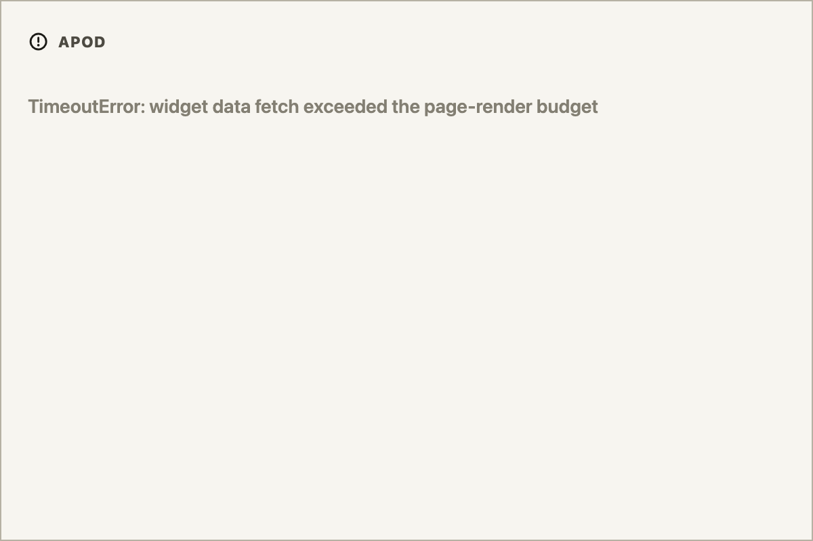

    NASA's Astronomy Picture of the Day, full bleed. Walks back day-by-day past video entries so the cell always shows an image. Uses DEMO_KEY by default; paste your own key at https://api.nasa.gov for a higher rate limit.

    **Sizes:** `sm` `md` `lg` &middot; **Tier:** Stable

-   **Picture, Gallery** &middot; `picture_gallery`

    ---

    

    Folder-based image rotation, full bleed. Manage folders + uploads at Widgets → Gallery. Supports internal folders (uploaded to the appliance) and external pointers to any directory on the host. Optional orientation filter + random or sequential rotation.

    **Sizes:** `sm` `md` `lg` &middot; **Tier:** Local

## Transit (GTFS)

-   **GTFS / GTFS-RT** &middot; `gtfs`

    ---

    _Screenshot pending, run `python scripts/capture_widget_shots.py`._

    Approaching vehicles at a stop (or two), from any GTFS feed. Presets for the NYC Subway and BART, live times and delays from GTFS-RT, service alerts, and an optional split-by-direction board.

    **Sizes:** `xs` `sm` `md` `lg` &middot; **Tier:** -

## Productivity

-   **Todo** &middot; `todo`

    ---

    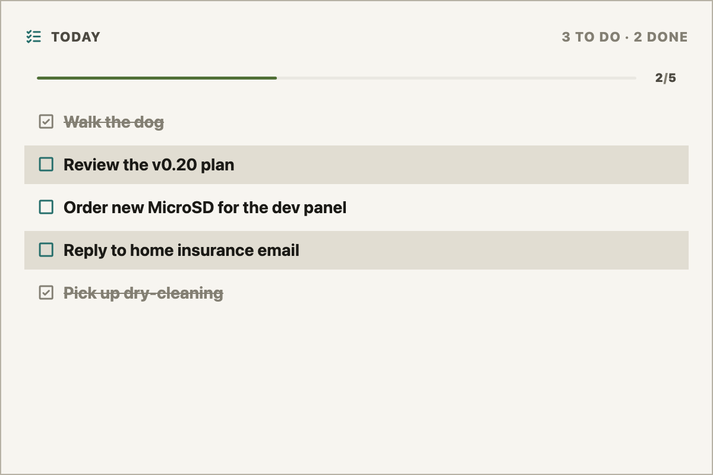

    Persistent todo lists. Create lists and add items on the admin page (Widgets → Todo); the widget cell renders the chosen list as a read-only checklist. Completed items auto-prune after 24 hours so the list doesn't grow indefinitely.

    **Sizes:** `xs` `sm` `md` `lg` &middot; **Tier:** Local

## Web

-   **Webpage** &middot; `webpage`

    ---

    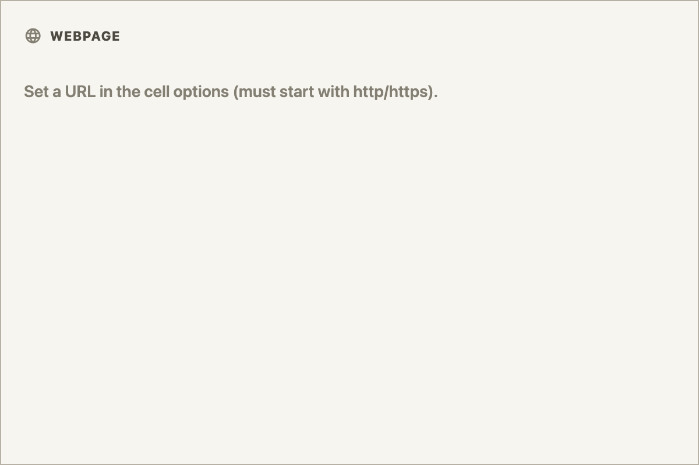

    Embed an external URL in a cell. The composer captures whatever the iframe renders, handy for status pages, public dashboards, or any site that doesn't deny embedding. A URL that points straight at an image (PNG, GIF, JPEG, WebP, SVG) is drawn as an image and scaled to the cell rather than embedded, so tall charts keep their bottom edge. Same headless-render path as the Send tab is used when the panel renders. Pages that fetch their data with JavaScript get a short settle delay after load so the content is captured, not a blank frame; raise it for slow pages. Sites that set X-Frame-Options:DENY or strict CSP cannot be embedded.

    **Sizes:** `sm` `md` `lg` &middot; **Tier:** -

## Countdown

-   **Countdown, Date** &middot; `countdown_date`

    ---

    _Screenshot pending, run `python scripts/capture_widget_shots.py`._

    Days remaining until a target date. Glanceable single-number hero with an optional label. Pure client-side, no network.

    **Sizes:** `xs` `sm` `md` `lg` &middot; **Tier:** Local

## Device

-   **Device Batteries** &middot; `device_battery`

    ---

    _Screenshot pending, run `python scripts/capture_widget_shots.py`._

    Battery level for every registered device that reports a battery_pct heartbeat (ESP32-S3, PhotoPainter, etc). Sorted lowest-first so the panel that needs charging surfaces to the top. Predicts days-to-empty from the last seven days of history, when available.

    **Sizes:** `xs` `sm` `md` `lg` &middot; **Tier:** Local

## Tesserae

-   **Tesserae, Status Bar** &middot; `tesserae_status`

    ---

    _Screenshot pending, run `python scripts/capture_widget_shots.py`._

    Dashboard status strip: identity on the left, ambient device telemetry on the right. Renders as a fixed-height bar (48 px) or a resizable block; each chip switches between icon+text, icon-only, or text-only. Temperature and humidity come from the target panel's status heartbeat. Auto-contrasts against a freeform background colour so it stays legible on 1-bit, 4-colour, and Spectra 6 panels. Update chips (app version, panel firmware) surface as a badge dot or accent text, never colour alone.

    **Sizes:** `xs` `sm` `md` `lg` &middot; **Tier:** -

## Year

-   **Year, Progress** &middot; `year_progress`

    ---

    _Screenshot pending, run `python scripts/capture_widget_shots.py`._

    How far through the year you are. Two modes: the current calendar year as a row of weekly dots, or 'life in weeks' as a long-form grid (give a birth year). Pure client-side, no network.

    **Sizes:** `xs` `sm` `md` `lg` &middot; **Tier:** Local

